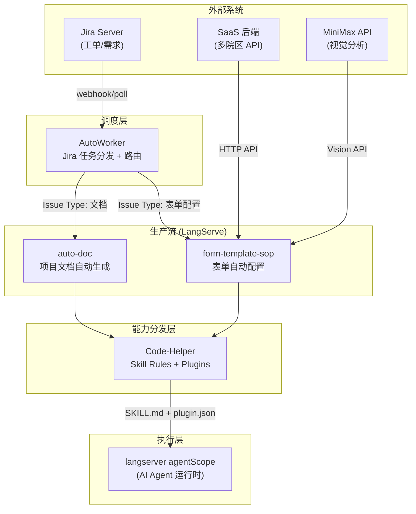
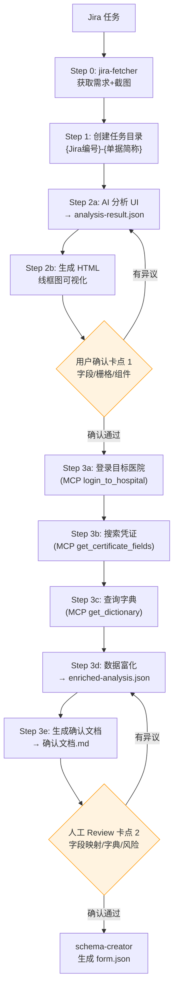
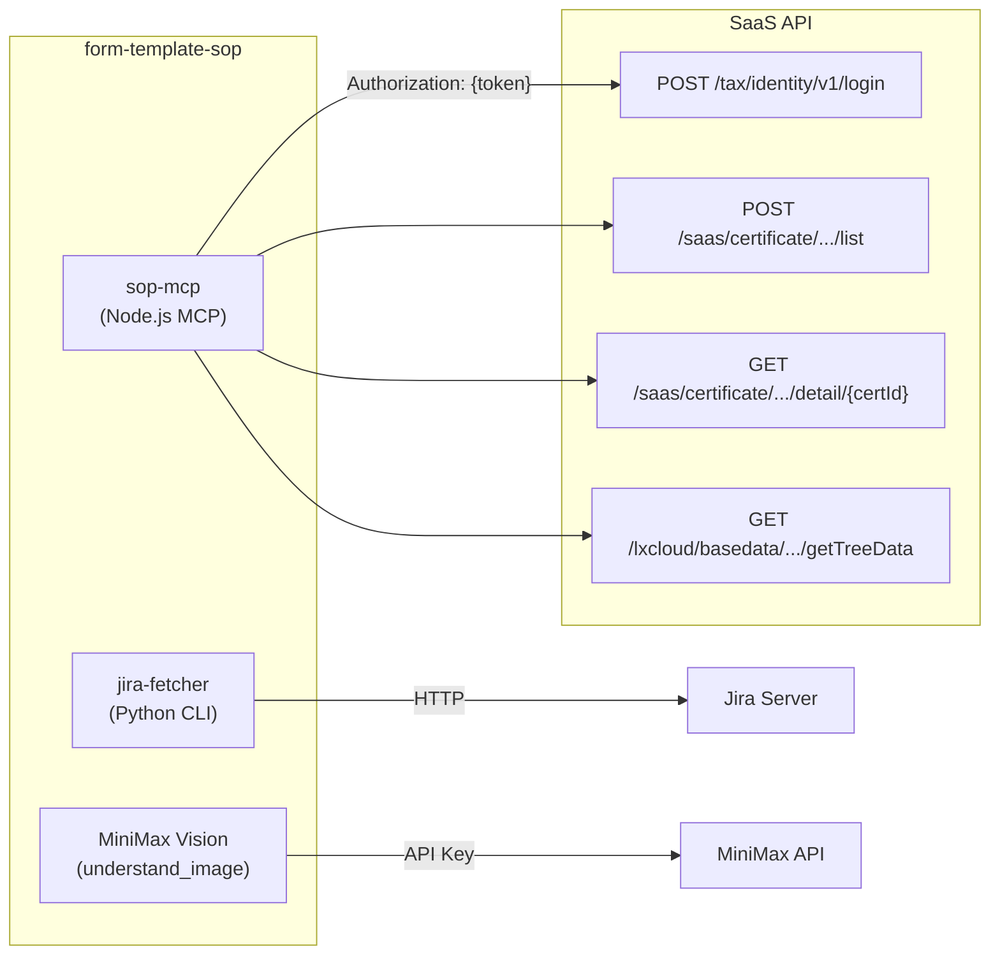
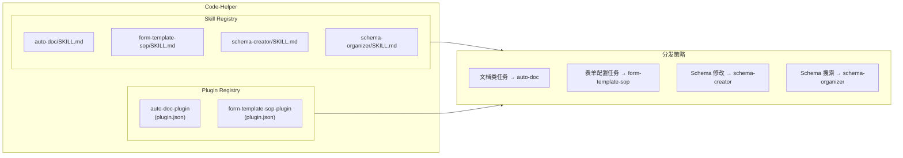

# form-template-sop 技术架构文档

## 一、系统全景架构

### 1.1 整体拓扑




### 1.2 生产流内部流程



### 1.3 外部系统依赖



### 1.4 Code-Helper 分发模型




### 1.5 完整拓扑（ASCII）
                              │            Jira Server               │
                              │        (工单 / 需求 / 任务分配)        │
                              └──────────────┬───────────────────────┘
                                             │ webhook / poll
                                             ▼
                              ┌──────────────────────────────────────┐
                              │           AutoWorker                 │
                              │        Jira 任务分发 + 路由           │
                              │                                      │
                              │  ┌────────────────────────────┐     │
                              │  │ 根据 Issue Type / Labels    │     │
                              │  │ 路由到对应「生产流」         │     │
                              │  └────────────────────────────┘     │
                              └──────┬───────────────┬───────────────┘
                                     │               │
                           ┌─────────┘               └─────────┐
                           ▼                                   ▼
              ┌──────────────────────┐          ┌──────────────────────┐
              │    LangServe         │          │    LangServe         │
              │   auto-doc 生产流    │          │ form-template-sop    │
              │                      │          │     生产流            │
              │  自动生成项目文档     │          │  表单自动配置         │
              │  (README/Wiki)       │          │  (事前申请/报销单)    │
              └──────────┬───────────┘          └──────────┬───────────┘
                         │                                 │
                         └────────────┬────────────────────┘
                                      │ skill rules + plugins
                                      ▼
                         ┌──────────────────────────────────┐
                         │          Code-Helper             │
                         │    Skill Rules + Plugins 分发     │
                         │                                  │
                         │  ┌────────────────────────────┐  │
                         │  │        Skill Registry       │  │
                         │  │  ├── auto-doc/SKILL.md     │  │
                         │  │  ├── form-template-sop/    │  │
                         │  │  │   ├── SKILL.md          │  │
                         │  │  │   └── ARCHITECTURE.md   │  │
                         │  │  ├── schema-creator/       │  │
                         │  │  └── schema-organizer/     │  │
                         │  ├────────────────────────────┤  │
                         │  │       Plugin Registry       │  │
                         │  │  ├── auto-doc-plugin/      │  │
                         │  │  │   └── plugin.json       │  │
                         │  │  └── form-template-sop-    │  │
                         │  │      plugin/               │  │
                         │  │      ├── plugin.json       │  │
                         │  │      ├── skills/           │  │
                         │  │      ├── mcp/              │  │
                         │  │      └── langserve/        │  │
                         │  └────────────────────────────┘  │
                         └──────────────────────────────────┘
                                      │
                                      ▼
                         ┌──────────────────────────────────┐
                         │          Claude Code             │
                         │    (AI Agent 执行运行时)          │
                         │                                  │
                         │  读取 SKILL.md → 执行 Steps       │
                         │  调用 MCP Tools → 获取接口数据    │
                         │  调用 LangServe API → 编排工作流  │
                         └──────────────────────────────────┘


═══════════════════════════════════════════════════════════════════
                    form-template-sop 内部流程
═══════════════════════════════════════════════════════════════════

  Jira 任务 ──→ Step 0: jira-fetcher ──→ 原始资料
                                        │
                                        ▼
                               Step 1: 创建任务目录
                                        │
                                        ▼
                               Step 2a: AI 分析 UI ──→ analysis-result.json
                                        │
                                        ▼
                               Step 2b: 生成 HTML 线框图
                                        │
                                   [用户确认]  ←── 卡点 1
                                        │
                                        ▼
                               Step 3a-d: MCP 取数 + 数据富化
                                  ├── login_to_hospital (Node.js MCP)
                                  ├── get_certificate_fields
                                  └── get_dictionary
                                        │
                                        ▼
                               Step 3e: 生成确认文档 .md
                                        │
                                   [人工 Review] ←── 卡点 2
                                        │
                                        ▼
                               schema-creator → form.json


═══════════════════════════════════════════════════════════════════
                    外部系统依赖
═══════════════════════════════════════════════════════════════════

  ┌──────────┐    ┌──────────────┐    ┌──────────────┐
  │  Jira    │    │  SaaS 后端   │    │  MiniMax API │
  │ Server   │    │ (多院区)     │    │ (视觉分析)   │
  └────┬─────┘    └──────┬───────┘    └──────┬───────┘
       │                 │                   │
       ▼                 ▼                   ▼
  jira-fetcher    form-template-      MiniMax Vision
  (Python CLI)    sop-mcp             understand_image
                  (Node.js MCP)
                       │
                       ├── POST /tax/identity/v1/login
                       ├── POST /saas/certificate/.../list
                       ├── GET  /saas/certificate/.../detail/{certId}
                       └── GET  /lxcloud/basedata/.../getTreeData


═══════════════════════════════════════════════════════════════════
                    Code-Helper 分发模型
═══════════════════════════════════════════════════════════════════

  ┌─────────────────────────────────────────────────────────────┐
  │                      Code-Helper                            │
  │                                                             │
  │  Skills/                         Plugins/                   │
  │  ├── auto-doc                   ├── auto-doc-plugin         │
  │  │   └── SKILL.md               │   ├── plugin.json         │
  │  ├── form-template-sop          │   └── chains/             │
  │  │   ├── SKILL.md               │                           │
  │  │   ├── ARCHITECTURE.md        ├── form-template-sop-      │
  │  │   ├── scripts/               │   plugin                  │
  │  │   ├── mcp/                   │   ├── plugin.json         │
  │  │   └── config/                │   ├── skills/             │
  │  ├── schema-creator             │   ├── mcp/                │
  │  │   └── SKILL.md               │   └── langserve/          │
  │  └── schema-organizer           │                           │
  │      └── SKILL.md               └───────────────────────────│
  │                                                             │
  │  分发策略:                                                   │
  │  ┌─────────────────────────────────────────────────────┐    │
  │  │ Task Type              → Skill           → Plugin   │    │
  │  │ ─────────────────────────────────────────────────── │    │
  │  │ 项目文档 / README       → auto-doc        → auto-   │    │
  │  │                                          doc-plugin │    │
  │  │ 表单配置 / 报销单        → form-template-  → form-   │    │
  │  │                           sop              template-│    │
  │  │                                            sop-     │    │
  │  │                                            plugin   │    │
  │  │ Schema 修改 / 新增字段   → schema-creator  (none)   │    │
  │  │ Schema 搜索 / 对比       → schema-         (none)   │    │
  │  │                           organizer                 │    │
  │  └─────────────────────────────────────────────────────┘    │
  └─────────────────────────────────────────────────────────────┘
```

## 二、概述

`form-template-sop` 是一个 AI 驱动的表单模板生成标准化流程（SOP），属于 Code-Helper 体系中的「表单自动配置」生产流。由 AutoWorker 从 Jira 分发任务后，LangServe 编排执行，通过「先分析 UI → 接口取数校准 → 生成确认文档 → 人工 Review」的多段式流程，解决 AI 配置表单时前置信息缺失、UI 理解偏差、联动边界遗漏等系统性问题。

### 核心设计原则

1. **信息前置**：配置前强制收集 Jira 需求、UI 截图、接口字段定义
2. **确认前置**：AI 在修改 Schema 之前生成确认文档，人工 Review 通过后才进入配置
3. **数据驱动**：Step 2 截图分析产出结构化 JSON → Step 3 通过 MCP 获取接口数据校准
4. **可追溯**：每次任务独立文件夹，完整归档分析记录和确认文档

---

## 三、Skill 内部架构

```
┌─────────────────────────────────────────────────────────────┐
│                      form-template-sop                      │
├─────────────────────────────────────────────────────────────┤
│                                                             │
│  Step 0              Step 1          Step 2                 │
│  jira-fetcher  ───→  创建任务  ───→  AI 分析 UI             │
│  (Python CLI)        目录结构        截图 → JSON → HTML      │
│       │                   │              │                  │
│       ▼                   ▼              ▼                  │
│  Jira 详情           任务文件夹      analysis-result.json   │
│  + 截图附件          + 原始资料      + HTML 可视化           │
│                                             │               │
│                              [用户确认 ◀────┘               │
│                                   │                         │
│  Step 3                          ▼                         │
│  MCP Server ◀────────── AI 调用取数                         │
│       │                       │                             │
│       ├── login_to_hospital   │                             │
│       ├── get_certificate_*   │                             │
│       └── get_dictionary      │                             │
│               │               │                             │
│               ▼               ▼                             │
│         接口字段定义    enriched-analysis.json               │
│         字典项数据       │                                  │
│                         ▼                                  │
│                  确认文档 (.md)                              │
│                         │                                  │
│                  [人工 Review]                              │
│                         │                                  │
│                         ▼                                  │
│                  schema-creator                             │
│                  (开始配置 form.json)                        │
└─────────────────────────────────────────────────────────────┘
```

---

## 四、Skill 设计

### 4.1 文件结构

```
.agents/skills/form-template-sop/
├── ARCHITECTURE.md               # 本文档
├── SKILL.md                      # 技能主入口，定义流程和规则
├── DESIGN.md                     # 设计文档（动机、对比、决策）
├── config/
│   └── accounts.json             # 医院登录账号映射
├── scripts/
│   ├── step1-create-task-folder.sh      # 创建任务目录
│   ├── step2-analyze-ui.py             # [参考] AI 输出格式
│   ├── generate-html-from-analysis.py  # JSON → HTML 可视化
│   ├── step3-generate-confirmation.py  # enriched JSON → 确认文档 .md
│   └── analysis-result.json            # JSON 数据格式模板
├── mcp/
│   ├── server.js                       # MCP Server 主入口 (stdio)
│   ├── package.json
│   └── lib/
│       ├── login.js                    # 登录逻辑
│       └── certificate-api.js          # 凭证接口封装
└── references/
    ├── SOP流程图.md
    └── 账号信息.md
```

### 3.2 六步流程

| 步骤 | 执行者 | 输入 | 输出 | 关键规则 |
|------|--------|------|------|----------|
| Step 0 | jira-fetcher (Python) | Jira 链接 | index.md + 截图 | 独立 CLI 工具 |
| Step 1 | Shell 脚本 | 任务名称 `{Jira编号}-{单据简称}` | `tasks/<名称>/` 四目录结构 | 命名强制规范 |
| Step 2a | AI + MiniMax Vision | UI 截图 | `analysis-result.json` | 必须覆盖头部信息 |
| Step 2b | Python 脚本 | JSON → `--screenshot` | HTML 线框图 | 头部渲染为元数据行 |
| Step 3a-d | AI + MCP Server | hospital + keyword | 接口数据 | 🚫 强制目标医院，严禁跨院 |
| Step 3e | Python 脚本 | enriched JSON | 确认文档 .md | 10 章结构 |

### 3.3 两个确认卡点

```
Step 2 ──→ [用户确认分析结果] ──→ Step 3 ──→ [人工 Review 确认文档] ──→ schema-creator
         字段名/顺序/栅格/组件类型                  字段映射/字典/风险项
```

### 3.4 Step 3 强制规则

1. **必须用目标医院账号登录**（查 `accounts.json`），严禁使用其他医院
2. **必须查目标医院单据**，严禁跨院查询
3. **登录失败直接反馈**阻塞风险，不继续
4. **查不到单据直接反馈**，不编造
5. **参考单据仅作配置参考**，不作为接口数据来源

---

## 五、MCP Server 设计

### 4.1 概述

- **名称**：`form-template-sop-mcp`
- **协议**：MCP (Model Context Protocol)，stdio transport
- **运行时**：Node.js (ESM)
- **依赖**：`@modelcontextprotocol/sdk`、`md5`

### 4.2 Tools 定义

| Tool | 功能 | 输入 | 输出 | 内部实现 |
|------|------|------|------|----------|
| `login_to_hospital` | 登录 SaaS 获取 token | `hospitalName: string` | `{ token, baseUrl, hospitalCode, ... }` | `lib/login.js` → `POST /tax/identity/v1/login` |
| `get_certificate_fields` | 递归提取凭证字段树 | `certCode: string` | `{ certName, fields[], tree[], groups }` | `lib/certificate-api.js` → list + detail + 递归 children |
| `get_dictionary` | 按字段名搜索字典 | `fieldName: string` | `{ keyword, items[{ dictName, dictCode, leaves[] }] }` | `GET /lxcloud/basedata/sreTsbdmMultDict/getTreeData` |
| `get_form_config` | 表单配置（fieldMapping等） | `certCode: string` | `{ fields[], definitionConfig, ... }` | 同 certificate detail |
| `get_behavior_model` | 行为模型数据 | `certCode: string` | 待确认 | 待确认接口 |

### 4.3 登录流程

```
findAccount(hospitalName) → accounts.json
  ↓
login(account)
  ↓
POST {baseUrl}/tax/identity/v1/login
  Body: {
    loginEntry: "0",
    agencyMainAccount: hospitalCode,
    account: username,
    password: md5(password + "bsrj20230721534345"),
    ePassword: md5(password)
  }
  ↓
Response: { token, lastLoginTime, ... }
  → 缓存到 session (token + baseUrl)
```

### 4.4 凭证查询流程

```
listCertificates(token, baseUrl)
  ↓
POST /saas/certificate/management/application/list
  → appType[] → cert{ certId, certCode, certName }
  ↓
findCertificate(certCode) → cert.certId
  ↓
getCertificateDetail(certId)
  ↓
GET /saas/certificate/management/certificateDefinition/detail/{certId}
  → children[] → 递归 walkTree()
  → definitionMetaList[] → map fields
```

### 4.5 字典查询流程

```
searchDictionary(keyword)
  ↓
GET /lxcloud/basedata/sreTsbdmMultDict/getTreeData?filterCondition={keyword}
  ↓
Response.Data[] → extract leaves (leaf nodes with code/label)
```

### 4.6 Session 管理

- `token`、`baseUrl` 缓存在 server 内存中（`login_to_hospital` 后设置）
- 后续 Tools 自动使用 session 中的认证信息，无需重复传入
- 服务重启后需重新登录

---

## 六、数据格式

### 5.1 analysis-result.json（Step 2 产出）

```json
{
  "task_info": { "jira_id", "hospital", "form_name", "terminal", "version", "analysis_time" },
  "sections": [
    { "title": "单据头部", "type": "header", "status": "待提交", "formTitle": "...",
      "fields": [{ "label": "单据编号", "value": "...", "auto": true }] },
    { "title": "基本信息", "grid": 3, "fields": [{ "title", "name", "component", "required", "gridSpan", "auto_fill", "read_only" }] },
    { "title": "表格分区", "type": "table", "columns": [{ "title", "required", "width" }] }
  ],
  "fields": [ // 扁平列表
    { "seq", "name", "title", "component", "required", "auto_fill", "reaction", "notes", "gridSpan" }
  ],
  "reactions": [{ "type": "自动计算/条件显示/自动回填", "description" }],
  "risks": [{ "type": "UI歧义/字段缺失/联动边界", "description" }],
  "pc_mobile_diff": { "layout": [...], "component": [...] }
}
```

**关键数据结构**：
- `sections[].type`：`"header"` / `"table"` / 不设 = 表单栅格
- header 无 `grid` 属性，label/value 对，`|` 分隔渲染
- table 需 `columns` 定义
- `fields[].gridSpan`：表单字段占用列数，header 字段为 0

### 5.2 enriched-analysis.json（Step 3d 产出）

在 `analysis-result.json` 基础上增加：
- `reference`：参考单据元信息
- `data_fetch`：接口取数结果摘要
- `fields[]._source`：`"接口确认"` / `"截图推测"` / `"待新建"`
- `fields[]._dictCheck`：`{ found, options[] }`
- `fields[].pc_component` / `fields[].mobile_component`：推荐组件
- `template_components`：可复用模板组件清单
- `dictionaries`：字典搜索结果
- `risks[].severity`：`"blocker"` / `"high"` / `"low"`

### 5.3 确认文档结构（Step 3 产出）

10 章结构：
1. 任务元信息
2. 接口取数结果
3. 字段清单 — 基本信息（PC+移动端双列组件）
4. 字段清单 — 表格子表
5. 模板组件引用
6. 字典校验
7. 联动关系
8. 风险项（按 ❌阻塞 / ⚠️高风险 / ℹ️低风险 分级）
9. PC vs 移动端差异
10. Review 确认

---

## 七、技术决策记录

| 决策 | 选择 | 原因 |
|------|------|------|
| MCP 协议 | stdio transport | Claude Code 原生支持，无需网络端口 |
| MCP 运行时 | Node.js | 前端团队技术栈一致，fetch/md5 生态好 |
| 密码加密 | md5(password + salt) | 对齐现有登录系统，salt 硬编码 |
| JSON 作数据交换 | analysis-result.json | 结构化、可被脚本消费、可版本追踪 |
| HTML 脚本生成 | Python（与 step3 同语言） | 保持 skill 内技术栈尽量统一 |
| 头部渲染 | `type: "header"` 独立类型 | 头部不是表单栅格，需特殊渲染 |
| 任务命名 | `{Jira编号}-{单据简称}` | 全局唯一，可追溯，不含中文特殊字符 |

---

## 八、与外部系统的关系

```
                    ┌──────────────┐
                    │  Jira Server │ ← jira-fetcher (Python, 独立 Skill)
                    └──────┬───────┘
                           │ HTTP
                    ┌──────▼───────┐
  accounts.json ───→│  SaaS 后端   │ ← form-template-sop-mcp (Node.js)
                    │  (多院区)     │    登录 + 凭证/字典 API
                    └──────┬───────┘
                           │ HTTP
                    ┌──────▼───────┐
                    │ MiniMax API  │ ← step2-analyze-ui.py (参考)
                    │ (视觉分析)    │    /images/v1/generations
                    └──────────────┘

  ┌──────────────────────────────────────────────────┐
  │              Form Template Repo                   │
  │  华西/ 湖南人民/ 福建人民/ ... / form.json         │
  │  模板组件/ $ref definitions/                      │
  └──────────────────────────────────────────────────┘
          ▲
          │ schema-creator (下一步)
          │ 依据确认文档生成 form.json
```

---

## 九、Plugin 打包方案

### 9.1 现状 vs 目标

| 维度 | 现状（散装） | 目标（Plugin） |
|------|-------------|---------------|
| 分发 | 手动拷贝 `.agents/skills/` 目录 | `plugin install form-template-sop` |
| 依赖 | MCP、Python 脚本各自管理 | 统一 `plugin.json` 声明 |
| 启动 | 手动 `npm start` MCP server | LangServe 统一拉起所有服务 |
| 状态 | 无持久化，session 内存 | LangServe 管理 workflow state |
| 版本 | 无版本号 | 语义化版本 + changelog |
| 配置 | 硬编码路径 | 统一 `config/` 目录 + 环境变量 |

### 9.2 Plugin 包结构

```
form-template-sop-plugin/
├── plugin.json                    # 插件元数据 + 依赖声明
├── README.md
├── config/
│   └── accounts.json              # 医院账号（可外部覆盖）
├── skills/
│   └── form-template-sop/
│       ├── SKILL.md
│       └── scripts/
│           ├── step1-create-task-folder.sh
│           ├── generate-html-from-analysis.py
│           └── step3-generate-confirmation.py
├── mcp/
│   ├── server.js                  # MCP Server (stdio)
│   ├── package.json
│   └── lib/
│       ├── login.js
│       └── certificate-api.js
├── langserve/
│   ├── app.py                     # LangServe 主入口
│   ├── chains/
│   │   ├── step2_analyze.py       # Step 2: 截图分析 Chain
│   │   ├── step3_enrich.py        # Step 3: 数据富化 Chain
│   │   └── step3_confirm.py       # Step 3: 确认文档生成 Chain
│   ├── tools/
│   │   ├── jira_fetcher.py        # Step 0: Jira 获取工具
│   │   ├── image_analyzer.py      # MiniMax 视觉分析工具
│   │   ├── mcp_bridge.py          # MCP Server 桥接 (HTTP→stdio)
│   │   ├── html_renderer.py       # HTML 生成工具
│   │   └── dict_validator.py      # 字典校验工具
│   └── state/
│       └── workflow.py            # Workflow 状态管理
├── pyproject.toml                 # Python 依赖
└── Makefile                       # install / start / test
```

### 9.3 plugin.json

```json
{
  "name": "form-template-sop",
  "version": "1.0.0",
  "description": "表单模板生成标准化 SOP — AI 驱动的分析→确认→配置流程",
  "type": "plugin",
  "entry": "langserve/app.py",
  "mcpServers": {
    "form-template-sop": {
      "command": "node",
      "args": ["mcp/server.js"]
    }
  },
  "dependencies": {
    "python": ">=3.10",
    "node": ">=18"
  },
  "config": {
    "accounts": "config/accounts.json",
    "minimax_api_key": "$MINIMAX_API_KEY"
  },
  "capabilities": ["jira-fetcher", "ui-analyzer", "dict-lookup", "confirmation-doc"]
}
```

---

## 十、LangServe 驱动设计

### 10.1 为什么 LangServe

| 需求 | LangServe 能力 |
|------|---------------|
| 多步工作流编排 | Chain/Graph 串联 Step 0→1→2→3 |
| AI 调用 MiniMax | `ChatModel` + Vision tool |
| MCP 工具集成 | Tool 封装，统一接口 |
| 人工确认卡点 | `interrupt` / `checkpoint` 暂停等用户输入 |
| 状态持久化 | LangGraph `Checkpointer` (SQLite/Postgres) |
| 对外 API | `/invoke`, `/stream`, `/playground` 标准端点 |
| 多端复用 | 同一套 Chain，Claude Code 和 Web UI 均可调用 |

### 10.2 架构分层

```
┌─────────────────────────────────────────────────────────────┐
│                        LangServe (Python)                   │
│                                                             │
│  ┌───────────────────────────────────────────────────────┐ │
│  │                    API Layer                           │ │
│  │   POST /workflow/start       → 创建任务                │ │
│  │   POST /workflow/{id}/step   → 执行步骤                │ │
│  │   GET  /workflow/{id}/state  → 查询状态                │ │
│  │   POST /workflow/{id}/review → 人工确认                │ │
│  │   GET  /playground           → 调试 UI                 │ │
│  └───────────────────────────────────────────────────────┘ │
│                            │                                │
│  ┌───────────────────────────────────────────────────────┐ │
│  │                  Workflow Graph                        │ │
│  │                                                       │ │
│  │  START → jira_fetch → create_folder → analyze_ui      │ │
│  │              │                          │              │ │
│  │              │                    [user_confirm_step2]  │ │
│  │              │                          │              │ │
│  │              │              enrich_data → gen_confirm  │ │
│  │              │                          │              │ │
│  │              │                   [user_review_step3]   │ │
│  │              │                          │              │ │
│  │              │                         END             │ │
│  └───────────────────────────────────────────────────────┘ │
│                            │                                │
│  ┌───────────────────────────────────────────────────────┐ │
│  │                    Tools Layer                         │ │
│  │                                                       │ │
│  │  ┌──────────┐ ┌──────────┐ ┌──────────┐               │ │
│  │  │ Jira     │ │ MiniMax  │ │ MCP      │               │ │
│  │  │ Fetcher  │ │ Vision   │ │ Bridge   │               │ │
│  │  │ (HTTP)   │ │ (API)    │ │ (stdio)  │               │ │
│  │  └──────────┘ └──────────┘ └──────────┘               │ │
│  │                                                       │ │
│  │  ┌──────────┐ ┌──────────┐ ┌──────────┐               │ │
│  │  │ HTML     │ │ Dict     │ │ Confirm  │               │ │
│  │  │ Renderer │ │ Validator│ │ Writer   │               │ │
│  │  │ (Jinja2) │ │ (logic)  │ │ (Jinja2) │               │ │
│  │  └──────────┘ └──────────┘ └──────────┘               │ │
│  └───────────────────────────────────────────────────────┘ │
│                            │                                │
│  ┌───────────────────────────────────────────────────────┐ │
│  │                   State Layer                          │ │
│  │   tasks/{jira_id}-{name}/                              │ │
│  │   ├── workflow_state.json   ← LangGraph checkpoint    │ │
│  │   ├── 原始资料/                                       │ │
│  │   ├── 分析结果/                                        │ │
│  │   └── 确认文档/                                        │ │
│  └───────────────────────────────────────────────────────┘ │
└─────────────────────────────────────────────────────────────┘
```

### 10.3 Workflow 定义（LangGraph）

```python
from langgraph.graph import StateGraph, END
from langgraph.checkpoint.sqlite import SqliteSaver

class SOPState(TypedDict):
    jira_url: str
    jira_data: dict
    task_name: str
    task_dir: str
    screenshots: list[str]
    analysis_json: dict      # Step 2 产出
    enriched_json: dict      # Step 3 产出
    confirm_doc: str         # 确认文档路径
    step2_confirmed: bool
    step3_confirmed: bool
    messages: list

workflow = StateGraph(SOPState)

# Nodes
workflow.add_node("step0_jira", fetch_jira_node)
workflow.add_node("step1_folder", create_folder_node)
workflow.add_node("step2_analyze", analyze_ui_node)
workflow.add_node("step2_html", generate_html_node)
workflow.add_node("step3_login", login_node)
workflow.add_node("step3_enrich", enrich_data_node)
workflow.add_node("step3_confirm", generate_confirm_doc_node)

# Edges
workflow.add_edge(START, "step0_jira")
workflow.add_edge("step0_jira", "step1_folder")
workflow.add_edge("step1_folder", "step2_analyze")
workflow.add_edge("step2_analyze", "step2_html")
workflow.add_edge("step2_html", "step3_login")
workflow.add_edge("step3_login", "step3_enrich")
workflow.add_edge("step3_enrich", "step3_confirm")
workflow.add_edge("step3_confirm", END)

# Checkpoints for human review
workflow.add_node("review_step2", human_review_node)
workflow.add_node("review_step3", human_review_node)
workflow.add_conditional_edges("step2_html", should_continue, {
    "confirm": "step3_login",
    "review": "review_step2"
})

app = workflow.compile(checkpointer=SqliteSaver("state.db"))
```

### 10.4 MCP Bridge 设计

LangServe (Python) 需要调用 Node.js MCP Server，通过子进程 stdio 桥接：

```python
# langserve/tools/mcp_bridge.py
import asyncio
import json

class MCPBridge:
    """Python ↔ Node.js MCP Server 桥接"""

    def __init__(self, server_path: str):
        self.server_path = server_path
        self.process = None

    async def start(self):
        self.process = await asyncio.create_subprocess_exec(
            "node", self.server_path,
            stdin=asyncio.subprocess.PIPE,
            stdout=asyncio.subprocess.PIPE,
        )

    async def call_tool(self, name: str, args: dict) -> dict:
        """通过 MCP JSON-RPC 协议调用 tool"""
        request = {
            "jsonrpc": "2.0",
            "method": "tools/call",
            "params": {"name": name, "arguments": args},
            "id": 1,
        }
        self.process.stdin.write(json.dumps(request).encode() + b"\n")
        response = await self.process.stdout.readline()
        return json.loads(response)

# 使用
bridge = MCPBridge("mcp/server.js")
await bridge.start()
token = await bridge.call_tool("login_to_hospital", {"hospitalName": "重庆儿童医院"})
fields = await bridge.call_tool("get_certificate_fields", {"certCode": "domesticStudyApplication"})
```

### 10.5 确认卡点设计

```
Step 2 完成后:
  LangServe 返回 { status: "awaiting_review", step: "step2", html_path: "..." }
  → 用户查看 HTML 线框图
  → POST /workflow/{id}/review { step: "step2", approved: true, comments: "..." }
  → workflow 继续执行 Step 3

Step 3 完成后:
  LangServe 返回 { status: "awaiting_review", step: "step3", confirm_doc: "..." }
  → 用户 Review 确认文档
  → POST /workflow/{id}/review { step: "step3", approved: true }
  → workflow 结束，可以进入 schema-creator
```

### 10.6 API 端点

| 端点 | 方法 | 说明 |
|------|------|------|
| `/workflow/start` | POST | 创建新任务，body: `{ jira_url, hospital, certCode? }` |
| `/workflow/{id}/state` | GET | 查询当前状态和产出 |
| `/workflow/{id}/step` | POST | 手动触发下一步（自动模式则跳过） |
| `/workflow/{id}/review` | POST | 人工确认 `{ step, approved }` |
| `/workflow/{id}/retry` | POST | 重试当前步骤 |
| `/workflow/{id}/output` | GET | 获取指定步骤产出（JSON/HTML/MD） |
| `/playground/{id}` | GET | LangServe Playground 调试 UI |

### 10.7 Claude Code 集成方式

```
Claude Code ←── MCP stdio ──→ Node.js MCP Server（取数工具）
     │
     │  通过 SKILL.md 规则驱动
     │  或直接调用 LangServe API
     │
     └──→ LangServe REST API（工作流编排）
          POST /workflow/start
          GET  /workflow/{id}/state
          POST /workflow/{id}/review
```

两种模式并存：
- **手动模式**：AI 读取 SKILL.md 规则，逐步手动调用工具（当前方式）
- **自动模式**：AI 调用 LangServe 端点，由工作流引擎自动执行步骤，在确认卡点暂停

---

## 十一、技术决策补充

| 决策 | 选择 | 原因 |
|------|------|------|
| 工作流引擎 | LangGraph (LangServe 内置) | StateGraph + Checkpointer 天然支持中断/恢复 |
| 状态持久化 | SQLite (SqliteSaver) | 单机部署零依赖，生产可换 Postgres |
| MCP 桥接 | Python subprocess + JSON-RPC | 保持 Node.js MCP Server 不变，无需重写 |
| HTML 渲染 | Jinja2 模板 | LangServe Python 生态，替代当前 Python 字符串拼接 |
| 确认文档 | Jinja2 Markdown 模板 | 可维护性优于 Python f-string 拼接 |
| 配置管理 | plugin.json + 环境变量 | 敏感信息不进 Git |

---

## 十二、迁移路径

```
Phase 1: 当前（已完成）
  ├── SKILL.md 规则驱动
  ├── Python 脚本（step1/2b/3）
  ├── Node.js MCP Server（step3 取数）
  └── AI 手动逐步执行

Phase 2: 插件化（规划中）
  ├── plugin.json 标准清单
  ├── pyproject.toml 统一 Python 依赖
  ├── Makefile install/start/test
  └── 保持现有执行模式不变

Phase 3: LangServe 驱动（规划中）
  ├── LangGraph workflow 编排
  ├── LangServe REST API
  ├── 确认卡点自动化
  ├── Playground 调试 UI
  └── 与 Claude Code 双模式共存
```
