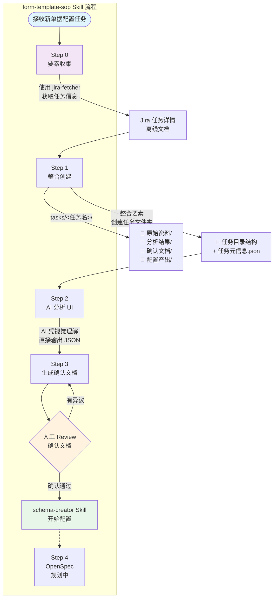

# SOP 流程图



## 流程说明

| 步骤 | 操作 | 说明 |
|------|------|------|
| **Step 0** | 要素收集 | 使用 `jira-fetcher` Skill 获取 Jira 任务信息 |
| Step 1 | 整合创建任务文件夹 | 整合要素 + 创建标准化任务目录 |
| Step 2 | AI 分析 UI | AI 看截图，凭视觉理解直接输出 JSON |
| Step 3 | 生成确认文档 | AI 结合分析结果生成 `.md` 确认文档 |
| **人工 Review** | **关键卡点** | 确认通过后才进入 schema-creator |
| 循环 | Review 有异议 | 回到 Step 3 调整确认文档 |

## 必需要素

| 要素 | 说明 | 来源 |
|------|------|------|
| JIRA 链接 | 工单/任务的 Jira 地址 | 用户提供 |
| 院区 | 如：华西医院、湖南人民医院 | 从 JIRA 解析或用户提供 |
| 单据名称 | 如：国外进修申请 | 从 JIRA 解析或用户提供 |
| 单据类型 | 如：事前申请、报销单 | 从 JIRA 解析或用户提供 |
| 目标端 | PC / 移动端 | 用户指定 |

## 任务目录结构

```
tasks/<任务名>/
├── 原始资料/      # UI 截图、接口文档
├── 分析结果/      # AI 输出的 JSON
├── 确认文档/      # 人工 Review 的 .md
└── 配置产出/      # 最终 form.json

任务元信息.json    # JIRA链接、院区、单据名称等要素
```

## 任务名称格式

`{Jira编号}-{单据简称}`，如 `YLZHXT-4428-科室进修批次申请`