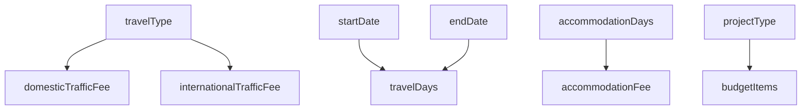

# Schema 分析示例

本文档提供具体的 schema 分析示例，帮助理解如何整理和分析各院区的表单配置。

## 示例 1: 单字段影响范围分析

### 任务：分析 `reimbursementTotalAmount` 字段的使用情况

#### Step 1: 全局搜索

```bash
# 在所有 JSON 文件中搜索该字段
grep -r '"name": "reimbursementTotalAmount"' --include="*.json" .
```

#### Step 2: 整理结果

预期找到的文件：
- ✅ 华西医院/报销单据/举办会议报销单_holdMeetingReimburseForm/pc/form.json
- ✅ 华西医院/报销单据/举办培训报销单_holdTrainingReimburseForm/pc/form.json
- ✅ 医大一/报销单据/举办会议报销单_holdMeetingReimburseForm/pc/form.json
- ✅ 所有涉及费用报销的单据类型

#### Step 3: 分析字段配置

在每个文件中检查：

```javascript
{
  "reimbursementTotalAmount": {
    "type": "string",
    "title": "报销金额",
    "x-component": "DtMoneyInput",
    "x-validator": [...],      // 校验规则
    "x-reactions": [...]       // 联动逻辑（如有）
  }
}
```

#### Step 4: 记录差异

创建对比表格：

| 院区 | 单据类型 | 组件类型 | 校验规则 | 特殊配置 |
|------|---------|---------|---------|---------|
| 华西医院 | 举办会议报销 | DtMoneyInput | 必须 > 0 | 无 |
| 医大一 | 举办会议报销 | DtMoneyInput | 必须 > 0 | 有联动隐藏逻辑 |

---

## 示例 2: 多院区同一单据对比

### 任务：对比华西医院和医大一的会议报销单

#### 文件路径

- **华西**: `华西医院/报销单据/举办会议报销单_holdMeetingReimburseForm/pc/form.json` (2641 lines)
- **医大一**: `医大一/报销单据/举办会议报销单_holdMeetingReimburseForm/pc/form.json` (2641 lines)

#### 对比维度

##### 1. 整体结构对比

```javascript
// 华西医院配置特点
{
  "form": {
    "x-component-props": {
      "labelWidth": 120,
      "title": "举办会议报销"
    }
  }
}

// 医大一配置特点
{
  "form": {
    "x-component-props": {
      "labelWidth": 135,        // 不同的 label 宽度
      // 无 title 属性
    }
  }
}
```

##### 2. 字段数量统计

```bash
# 统计顶层字段数量
jq '.properties.form.properties | keys | length' form.json
```

假设结果：
- 华西医院：45 个字段
- 医大一：43 个字段

##### 3. 特有字段识别

**华西医院独有字段**:
- `meetingApprovalNo` (会议批准文号)
- `participantCount` (参会人数)

**医大一独有字段**:
- `budgetCode` (预算编码)
- `expenseCategory` (费用类别)

##### 4. 相同字段的不同配置

以 `holdDate` 字段为例：

```javascript
// 华西医院
"holdDate": {
  "type": "string",
  "title": "举办日期",
  "x-component": "DtDatePicker",
  "required": true
}

// 医大一
"holdDate": {
  "type": "array",
  "title": "举办日期范围",
  "x-component": "DtRangePicker",  // 不同的组件
  "required": true
}
```

#### 输出对比报告

```markdown
# 会议报销单配置差异报告

## 基本信息
- 对比时间：2026-03-25
- 对比版本：华西医院 vs 医大一

## 主要差异

### 1. 表单配置
- labelWidth: 华西 (120px) vs 医大一 (135px)
- 标题显示：华西 (显示) vs 医大一 (隐藏)

### 2. 字段差异
- 华西独有：2 个字段
- 医大独有：2 个字段
- 配置不同：5 个字段

### 3. 组件使用
- 华西：更多使用标准 Dt* 组件
- 医大：定制化组件较多

### 4. 校验规则
- 华西：3 处自定义校验器
- 医大：5 处自定义校验器

## 建议

1. **统一 labelWidth**: 建议统一为 135px
2. **合并特有字段**: 评估是否可以互相复用
3. **标准化组件**: 优先使用标准组件
```

---

## 示例 3: 模板组件使用情况分析

### 任务：分析 `TaxBaseProjectInfo` 组件的使用

#### Step 1: 定位组件定义

组件路径：
- `华西医院/事前申请/模板组件/pc/TaxBaseProjectInfo_application_budgetItems.json`
- `医大一/事前申请/模板组件/pc/TaxBaseProjectInfo_application_budgetItems.json`

#### Step 2: 查找引用位置

```bash
# 搜索组件引用
grep -r '"x-component": "TaxBaseProjectInfo"' --include="*.json" .
```

#### Step 3: 整理引用列表

预期结果：

**华西医院**:
- 出差申请单 (`businessTripApplicationForm`)
- 举办会议申请单 (`holdMeetingApplicationForm`)
- 举办培训申请单 (`holdTrainingApplicationForm`)

**医大一**:
- 因公出差审批表 (`businessTravelApproval`)
- 举办会议报销单 (`holdMeetingReimburseForm`)

#### Step 4: 分析使用方式

```javascript
// 典型使用示例
"projectInfo": {
  "x-component": "TaxBaseProjectInfo",
  "x-component-props": {
    "projectType": "all",        // 项目类型
    "enableBudgetCheck": true,   // 启用预算控制
    "multiSelect": false         // 单选/多选
  }
}
```

#### Step 5: 检查配置一致性

对比不同使用场景下的配置参数：

| 单据类型 | projectType | enableBudgetCheck | multiSelect | 特殊配置 |
|---------|-------------|-------------------|-------------|---------|
| 出差申请 | all | true | false | 无 |
| 会议申请 | research | true | false | 限制科研项目 |
| 培训申请 | all | false | true | 允许多选 |

---

## 示例 4: 批量修改操作

### 任务：统一修改所有报销单的实付金额校验规则

#### 当前问题

多个院区的报销单使用不同的校验逻辑：

```javascript
// 版本 A (华西)
"payableAmount": {
  "x-validator": [{
    "message": "实付金额必须等于收款合计",
    "validator": "{{(value, rule, context) => {\n  const { form } = context\n  const paymentAmountField = form.query('paymentInfo').take()\n  const paymentTotalAmount = paymentAmountField?.data?.totalAmount || 0\n\n  if (value && value !== paymentTotalAmount) {\n    return Promise.reject('实付金额与收款金额合计不一致')\n  }\n}}}"
  }]
}

// 版本 B (医大一)
"payableAmount": {
  "x-validator": [{
    "pattern": "^\\d+\\.\\d{2}$",
    "message": "金额格式不正确"
  }]
}
```

#### 修改方案

**目标**: 统一使用版本 A 的校验逻辑

#### 执行步骤

##### Step 1: 列出需要修改的文件

```bash
# 找到所有包含 payableAmount 的文件
grep -r '"name": "payableAmount"' --include="*/form.json" . > files.txt
```

##### Step 2: 创建备份

```bash
# 为每个文件创建备份
for file in $(cat files.txt); do
  cp "$file" "$file.bak"
done
```

##### Step 3: 批量替换

使用文本编辑工具或脚本：

```javascript
// Node.js 脚本示例
const fs = require('fs');
const path = require('path');

const files = fs.readFileSync('files.txt', 'utf-8').split('\n');

const standardValidator = {
  "x-validator": [{
    "message": "实付金额必须等于收款合计",
    "validator": "{{(value, rule, context) => {\n  const { form } = context\n  const paymentAmountField = form.query('paymentInfo').take()\n  const paymentTotalAmount = paymentAmountField?.data?.totalAmount || 0\n\n  if (value && value !== paymentTotalAmount) {\n    return Promise.reject('实付金额与收款金额合计不一致')\n  }\n}}}"
  }]
};

files.forEach(file => {
  if (!file.trim()) return;
  
  const content = fs.readFileSync(file, 'utf-8');
  // 查找并替换 payableAmount 的 validator
  // ... 实现替换逻辑
  
  fs.writeFileSync(file, updatedContent);
});
```

##### Step 4: 验证修改

```bash
# 验证 JSON 格式
for file in $(cat files.txt); do
  jq '.' "$file" > /dev/null || echo "Invalid JSON: $file"
done
```

##### Step 5: 测试验证

对每个修改的单据类型：
- [ ] 在开发环境加载表单
- [ ] 填写测试数据
- [ ] 验证校验规则生效
- [ ] 提交测试

---

## 示例 5: Schema 结构树生成

### 任务：为复杂表单生成结构树

以 `华西医院/事前申请/出差申请单_businessTripApplicationForm/pc/form.json` 为例

#### 提取工具

```javascript
function extractSchemaTree(schema, indent = 0) {
  const prefix = '  '.repeat(indent);
  let result = '';
  
  if (schema.name) {
    result += `${prefix}├─ ${schema.name} (${schema.type})`;
    if (schema['x-component']) {
      result += ` [${schema['x-component']}]`;
    }
    result += '\n';
  }
  
  if (schema.properties) {
    for (const key of Object.keys(schema.properties)) {
      result += extractSchemaTree(schema.properties[key], indent + 1);
    }
  }
  
  return result;
}
```

#### 生成的结构树

```
form (void) [DtForm]
  ├─ subTitle (void) [div]
    ├─ documentCode (string) [CertBillNo]
    ├─ applicationDate (string) [DtDatePicker]
  ├─ BaseInfo (void) [TaxBaseInfo]
    ├─ reimbursementPeople (array) [TaxBasePersonTreeTableDialogSelect]
    ├─ travelType (string) [DtSelect]
    ├─ startDate (string) [DtDatePicker]
    ├─ endDate (string) [DtDatePicker]
  ├─ TravelDetail (void) [DtForm.DtFormTableFieldSet]
    ├─ transportationFee (object) [DtFormFieldSet]
      ├─ trafficType (string) [DtSelect]
      ├─ amount (number) [DtNumber]
    ├─ accommodationFee (object) [DtFormFieldSet]
      ├─ days (number) [DtNumber]
      ├─ amount (number) [DtNumber]
  ├─ BudgetInfo (void) [TaxBaseProjectInfo]
    ├─ projectCode (string) [DtInput]
    ├─ budgetItem (string) [DtSelect]
    ├─ amount (number) [DtMoneyInput]
  ├─ PaymentInfo (void) [TaxBaseFeeReceipt]
    ├─ payeeName (string) [DtInput]
    ├─ bankAccount (string) [DtInput]
    ├─ bankName (string) [DtSelect]
```

#### 使用场景

1. **快速了解表单结构**
2. **识别嵌套层级过深的字段**
3. **规划重构方案**
4. **编写文档说明**

---

## 示例 6: 联动逻辑分析

### 任务：分析表单中的 x-reactions 配置

#### 提取所有联动规则

```bash
# 搜索所有 x-reactions 配置
grep -A 20 '"x-reactions"' form.json > reactions.txt
```

#### 分类整理

##### 类型 1: 字段隐藏/显示

```javascript
{
  "dependencies": ["travelType"],
  "fulfill": {
    "state": {
      "visible": "{{ $deps.travelType === 'domestic' }}"
    }
  }
}
```

**应用场景**:
- 国内差旅显示市内交通费，国外差旅隐藏
- 住宿天数根据是否提供住宿决定

##### 类型 2: 数据联动

```javascript
{
  "dependencies": ["startDate", "endDate"],
  "fulfill": {
    "state": {
      "value": "{{ Math.max(0, $deps.endDate - $deps.startDate) }}"
    }
  }
}
```

**应用场景**:
- 出差天数自动计算
- 报销金额汇总

##### 类型 3: 选项动态调整

```javascript
{
  "dependencies": ["projectType"],
  "fulfill": {
    "state": {
      "dataSource": "{{ $deps.projectType === 'research' ? researchItems : generalItems }}"
    }
  }
}
```

**应用场景**:
- 根据项目类型过滤预算科目
- 根据人员类型过滤费用项

#### 绘制联动关系图



---

## 示例 7: 校验规则汇总

### 任务：整理某表单的所有校验规则

#### 提取方法

```javascript
// 递归提取所有 validator
function extractValidators(schema, path = '') {
  const rules = [];
  
  if (schema['x-validator']) {
    rules.push({
      path: path || schema.name,
      validators: schema['x-validator']
    });
  }
  
  if (schema.properties) {
    for (const [key, value] of Object.entries(schema.properties)) {
      rules.push(...extractValidators(value, path ? `${path}.${key}` : key));
    }
  }
  
  return rules;
}
```

#### 整理结果示例

**表单**: 华西医院 - 出差申请单

| 字段名 | 校验类型 | 校验规则 | 错误信息 |
|--------|---------|---------|---------|
| reimbursementPeople | required | 不能为空 | 请选择报销人员 |
| travelType | required + enum | 必须选择差旅类型 | 请选择差旅类型 |
| startDate | required + date | 必须早于今天 | 出差开始日期不能晚于今天 |
| endDate | required + date | 必须晚于 startDate | 结束日期必须晚于开始日期 |
| budgetItem | required | 必须选择预算科目 | 请选择预算科目 |
| amount | number + min | 必须大于 0 | 金额必须大于 0 |
| payeeName | required + max_length | 最多 50 字 | 收款人姓名不能超过 50 字 |

---

## 实战练习

### 练习 1: 找出所有使用 `DtMoneyInput` 组件字段

提示：
```bash
grep -r '"x-component": "DtMoneyInput"' --include="*.json" .
```

### 练习 2: 统计某个院区有多少种单据类型

提示：
```bash
find 华西医院 -name "form.json" | grep -v "模板组件" | wc -l
```

### 练习 3: 找出所有包含自定义 validator 函数的字段

提示：
```bash
grep -B 5 '"validator": "{{' form.json | grep '"name"'
```

---

## 总结

通过以上示例，我们掌握了以下 schema 整理技能：

1. ✅ **单字段影响分析** - 快速定位字段使用位置
2. ✅ **多院区对比** - 识别配置差异和特色配置
3. ✅ **模板组件分析** - 了解组件复用情况
4. ✅ **批量修改操作** - 高效统一配置变更
5. ✅ **结构树生成** - 可视化表单层次结构
6. ✅ **联动逻辑分析** - 理解字段间依赖关系
7. ✅ **校验规则汇总** - 整理业务规则清单

这些技能可以应用于：
- 新项目配置开发
- 历史配置迁移
- 配置标准化改造
- 问题排查与修复
